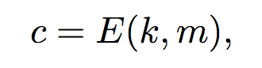
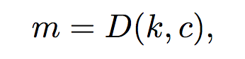
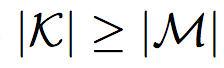
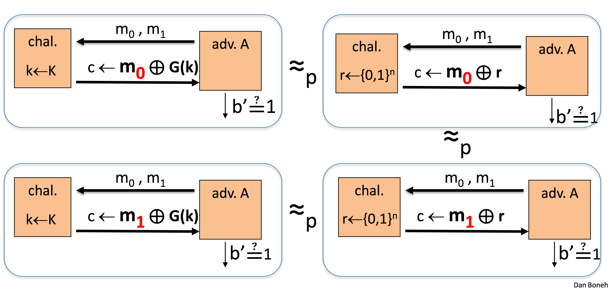
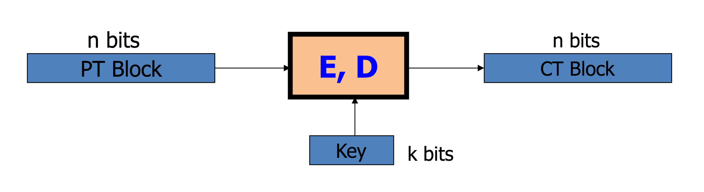
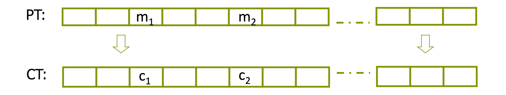

class: animation-fade
layout: true

---

class: impact

# Криптография
## без криптокупюр

---

# One Time Pad

--

* Что это? 
--
Схема шифрования (Cipher).

--

    

    ```
       7 (H)   4 (E)  11 (L)  11 (L)  14 (O) сообщение (m)
    + 23 (X)  12 (M)   2 (C)  10 (K)  11 (L) ключ шифрования (k)
    = 30      16      13      21      25     m + k
    =  4 (E)  16 (Q)  13 (N)  21 (V)  25 (Z) (m + k) mod 26
          E       Q       N       V       Z  → шифротекст (c)
    ```

--
    

    ```
        4 (E)  16 (Q)  13 (N)  21 (V)  25 (Z) шифротекст (c)
    -  23 (X)  12 (M)   2 (C)  10 (K)  11 (L) ключ шифрования (k)
    = -19       4      11      11      14     c – k
    =   7 (H)   4 (E)  11 (L)  11 (L)  14 (O) c – k (mod 26)
           H       E       L       L       O  → сообщение (m)
    ```

---

# One Time Pad

* Какая задача? 
--
Конфиденциальность (Confidentiality).

--

    - Возможность скрыть от посторонних глаз содержимое сообщения.

--

* Насколько он хорош в этой задаче? 
--
_Идеально_ хорош. 🌝

--

    - Обладает свойством _perfect security_. 

--
    - Не раскрывает _ни крупицы_ информации об исходном сообщении. 

--
    - Лучшее, что есть в криптографии.

--

* Почему же им никто не пользуется? 
--
Непрактично. 🌚

--

    - Размер _ключа_ должен быть не меньше размера _сообщения_.

--
    

---

# One Time Pad

> During WWII the Soviet Union could not produce enough one-time pads ... to keep up with the enormous demand .... So, they used a number of one-time pads twice, thinking it would not compromise their system. American counter-intelligence during WWII collected all incoming and outgoing international cables. Beginning in 1946, it began an intensive effort to break into the Soviet messages with the cooperation of the British and by ... the Soviet error of using some one-time pads as two-time pads, was able, over the next 25 years, to break some 2900 messages, containing 5000 pages of the hundreds of thousands of messages that had been sent between 1941 and 1946 (when the Soviets switched to a different system).
>
> <cite>Harvey Klehr</cite>

---

# Symmetric ciphers


---

# Stream ciphers

--

* Например, One Time Pad.

--

* Как решить проблему с длиной ключа?

--

* Ответ есть! 
--
**CSPRNG**! 

--

    

---

# Stream ciphers

## CSPRNG

Криптографический генератор псевдослучайных чисел (Cryptographically secure pseudo-random number generator).

--

* Эффективный 
--
детерминированный 
--
алгоритм $ G = (S, R) $.

--

* На вход подаётся seed $ s \in S, S = \\{0,1\\} ^ l $.

--

* В результате последовательность $ r \in R, R = \\{0,1\\} ^ L $.

--

* $ l \ll L $!

---

# Stream ciphers

## Схема шифрования

Имея на руках _надёжный_ генератор случайных чисел, мы можем шифровать сообщения, гарантируя их _конфиденциальность_.

--

* $ E(s, m) := G(s)[0 .. v - 1] \oplus m $

--

* $ D(s, c) := G(s)[0 .. v - 1] \oplus c $

--

## XOR

|            |   |   |   |   |   |
| ---------- | - | - | - | - | - |
|            | 0 | 0 | 1 | 1 | $ = n $ |
| $ \oplus $ | 0 | 1 | 0 | 1 | $ = m $ |
| $ = $      | 0 | 1 | 1 | 0 |   |

--
| $ \oplus $ | 0 | 1 | 0 | 1 | $ = m $ |
|            | 0 | 0 | 1 | 1 | $ = n $ |


---

# Semantic security

--

Возможность скрыть _абсолютно_ всю информацию от глаз злоумышленника не представляется возможным. 
--
Нужна более практичная возможность _измерить_ надёжность той или иной схемы шифрования.

--

* Злоумышленники обладают _ограниченными_ вычислительными ресурсами.

--

* Схема шифрования надёжна, если вероятность извлечь информацию из шифротекста _крайне мала_.

--

    - например, $ \varepsilon \leq \frac{1}{2 ^ {80}} $,
    - но не $ \varepsilon \geq \frac{1}{2 ^ {30}} $

---

# Semantic security

## Вероятностный эксперимент

--

* Мы хотим, чтобы вывод генератора был _неотличим_ от случайного набора бит.

--

* Предложим злоумышленнику сыграть в _игру_, где он:
    - выбирает пару сообщений ($ m_0, m_1 \in M $),
    - передаёт их _честному судье_,
    - судья выбирает случайно одно из сообщений ($ b \xleftarrow{R} \\{0, 1\\} $),
    - шифрует его при помощи _случайного набора бит_ ($ c \leftarrow m_b \oplus \\{0,1\\}^l $),
    - и возвращает злоумышленнику;
    - тот должен решить, первое или второе сообщение было зашифровано ($ b^\prime \leftarrow \\{0, 1\\} $).

--

* Вероятность выбрать правильный вариант $ Pr[b = b^\prime] = \frac{1}{2} $.

---

# Semantic security

## Вероятностный эксперимент



Схема _надёжна_, если $ |Pr[b_1 = b_1^\prime] - Pr[b_2 = b_2^\prime]| \leq \varepsilon $.

---

# Stream ciphers

## Надёжность

* Stream cipher _семантически надёжен_, если злоумышленник не может предсказать следующий бит вывода генератора случайных чисел, если ему известны _все_ предыдущие. 
--
Но неизвестно внутреннее состояние, заданное _секретным ключом_. 
--
Генератор считается _непредсказуемым_ (Unpredictability).

--

* Но что если мы модифицируем игру? 
--
Дадим злоумышленнику возможность сформировать _более_ одной пары сообщений.

--

    $ c_1 \leftarrow m_1 \oplus G(k) $

    $ c_2 \leftarrow m_2 \oplus G(k) $

    $ m^\prime \leftarrow c_1 \oplus c_2 $

---

# Stream ciphers

## Надёжность

* Текст на естественном языке _неслучаен_, в $ m^\prime $ много информации об исходном сообщении!

--

* Если шифровать _файлы_, в заголовках которых часто встречается один и тот же набор бит, можно раскрыть часть вывода генератора!

--

### Stream cipher нельзя использовать для шифрования различных сообщений с одним и тем же ключом!

---

# Block ciphers

--



$ \\{ E(K, M), D(K, C) \\} $

$ K \in \\{0,1\\}^k $

$ M, C \in \\{0,1\\}^n $

--

## AES

* Блоки размера 128 бит.
* Ключ размера 128, 192 или 256 бит.

---

# Block ciphers

## Надёжность

* Можно использовать один и тот же _секретный ключ_ более одного раза. 
--
Устойчив к модифицированной игре со злоумышленником. 
--
Называется Chosen Plaintext Attack, сокращённо CPA.

--

* Злоумышленник должен отличить _схему шифрования_ от _идеально случайной функции перестановки_ (Perfect Random Permutation).

    $ k \xleftarrow{R} K, f \leftarrow E(k, \cdot) \Rightarrow |E(k, \cdot)| = |K| = 2^k $
    
    $ f \xleftarrow{R} Perms[M] \Rightarrow |Perms[M]| = |M|! \approx 2^{2^{135}} $

--

* Блоки _ограниченного_ размера. Как зашифровать сообщение _любой_ длины?

---

# Block ciphers

## Electronic Code Book (ECB)

Что если мы просто разобьём на блоки и зашифруем каждый блок по отдельности?



--

* Не является _семантически надёжной_ схемой. 
--
Блоки с одним и тем же содержимым шифруются в _идентичный_ шифротекст.

    $ m_1 = m_2 \Rightarrow c_1 = c_2 $

---

# Block ciphers

## Deterministic Counter Mode (CTR)

Что если мы разобьём на блоки и будем _складывать_ их содержимое с результатом шифрования _номера_ блока?

|            |   |   |   |   |
| ---------- | - | - | - | - |
|            | $ m[0] $   | $ m[1] $   | ... | $ m[l] $   |
| $ \oplus $ | $ E(k,0) $ | $ E(k,1) $ | ... | $ E(k,l) $ |
| $ = $      | $ c[0] $   | $ c[1] $   | ... | $ c[l] $   |

--

* _Нельзя_ использовать один и тот же ключ дважды. 
--
Как и в случае со stream cipher.

---

# Block ciphers

## Cipher Block Chaining (CBC)

Что если мы используем _случайность_ для схемы шифрования? 
--
Введём Initial Vector (IV) – блок, состоящий из случайного набор бит.
--


--

* IV – _часть_ шифротекста. 

--

* Схема, _надёжная_ относительно CPA.

---

class: impact

# Криптопауза

---

* PKCS7 padding

* AES CBC padding oracle

* Будет пятисотить на невалидный padding в последнем блоке

* http://10.4.52.9:8000/
    - POST
    - formdata
    - ct={ciphertext}

```
00000000: 058e c2be 7263 6492 7cf0 ddf9 6337 c613  ....rcd.|...c7..
00000010: 313d eae2 2c9a 2da0 9530 1fd9 ca14 5c02  1=..,.-..0....\.
00000020: e972 2cb6 e5ef 6367 213e ad25 5c65 7ed9  .r,...cg!>.%\e~.
00000030: 56f6 071e 8856 2013 7f76 b140 bb94 0112  V....V ..v.@....
```
