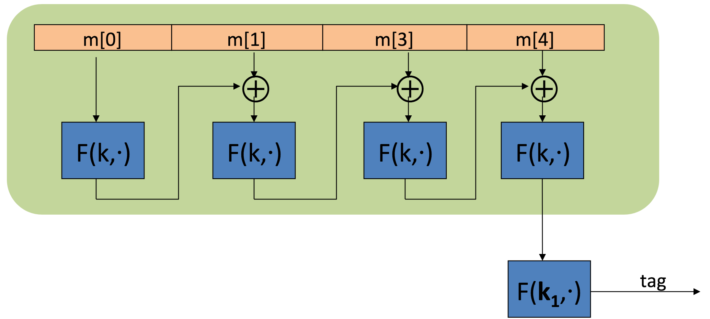
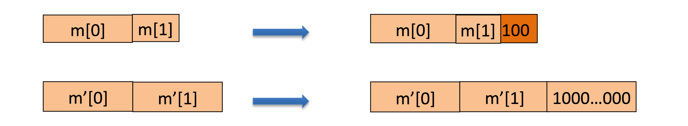
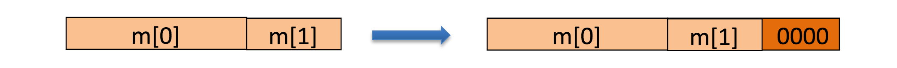
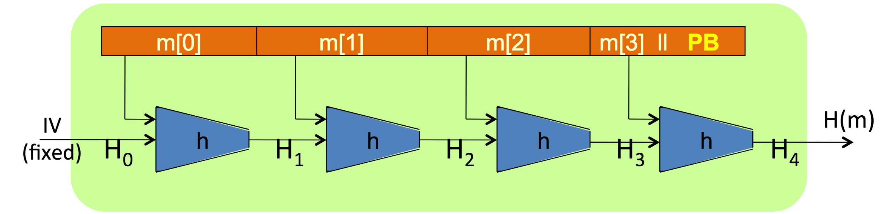

class: animation-fade
layout: true

---

class: impact

# Криптография
## без криптокупюр

---

# MAC

Сокращённо **M**essage **A**uthentication **C**ode.

--

## Задачи
--

* контроль _целостности_ сообщений,

--

* верификация _аутентичности_ сообщений.

--

## Алгоритм

Состоящий из $ (S, V) $, где

$ t \leftarrow S(k, m) $

$ v \leftarrow V(k, m, t), v \in \\{valid, invalid\\} $

### Нужен ключ, иначе гарантировать _аутентичность_ невозможно!

---

# MAC

## Надёжность

--

* Надёжен до тех пор, пока злоумышленник не может в _Existential Forgery_.

--

    - сложно получить $ (m_i, t^\prime) $, где $ t^\prime \neq t_i $
--
    - сложно получить $ (m^\prime, t^\prime) \notin \\{ (m_1, t_1) .. (m_n, t_n) \\} $

--

### Игра со злоумышленником

* Судья выбирает секретный ключ $ k $.
* Злоумышленник формирует $ q $ сообщений и отправляет судье.
* Судья возвращает $ S(k,m_1) .. S(k,m_q) $ злоумышленнику.
* Злоумышленник предоставляет судье $ (m,t) \notin \\{ (m_1, t_1) .. (m_q, t_q) \\} $

Вероятность того, что $ V(k,m,t) = valid $ должна быть _крайне мала_!

---

# MAC

## Конструкции

* Можно ли использовать $ AES(k, \cdot) $ в качестве MAC? 
--
Можно. 

--

* Проблема в том, что длина блока ограничена. 
--
Here comes _CBC-MAC_.

---

# MAC

## CBC-MAC

.col-8[
    
]

В качестве $ F $ можно использовать AES:

$ AES(k_1, \\\\ \\quad AES(k, m[n] \oplus \\\\ \\qquad AES(k, m[n-1] \oplus \\\\ \\qquad \\quad ... \\\\ \\qquad \\qquad AES(k, m[0])))) $

---

# MAC

## CBC-MAC

Что если длина сообщения не кратна размеру блока? 🙄 
--
Конечно же добавить _padding_.

--

--

Почему бы просто не добавить кучу нулей?

--
🙅

---

# MAC

## Хэширование

Хэш-функция $ H(m) = t $, где $ m \in M, t \in T $.

--

* Детерминированная функция

--

* $ |M| \gg |T| $

--

* _Крайне сложно_ восстановить $ m $, имея на руках $ t $

--

* Незначительное изменение в $ m $ должно приводить к значительным изменениям в $ t $

--

* Устойчивость к коллизиям (Collision Resistance)

    - Коллизия – это пара $ m_0,m_1 \in M $, для которых $ H(m_0) = H(m_1) $

--
    - Вероятность злоумышленнику найти коллизию должна быть _крайне мала_!

---

# MAC

## SHA-256

* Размер хэша 256 бит, $ |T| = 2^{256} $.

    

--

* Функция компрессии $ h(H,m) = H^\prime, m \in \\{0,1\\}^{512} $

--

* В частности $ h(H,m) = E(m,H) \oplus H $, где $ E $ – схема блочного шифрования SHACAL-2.

--

* Padding вида $ 1000..0 \\| length(m) $.

---

# MAC

## Конструкции

--

* Хэш-функция не даёт нам контроля _аутентичности_.

--

* Что нужно сделать, чтобы это обеспечить? 
--
Here comes _HMAC_ (Hash-based MAC).

---

# MAC

## HMAC

Взяв в руки SHA-256 как _устойчивую к коллизиям_ хэш-функцию мы можем построить _устойчивую к подделке (forgery)_ схему MAC.

--

* $ S(k,m) := H(k \oplus opad \\| H(k \oplus ipad \\| m)) $

* $ V(k,m,t) := S(k,m) = t $

--

Чтобы внешний и внутренний ключи имели _меньше_ совпадающих бит:

* $ ipad := 0x363636..36 $

* $ opad := 0x5c5c5c..5c $
