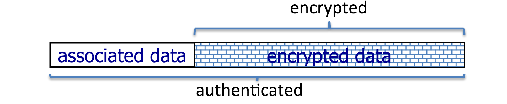
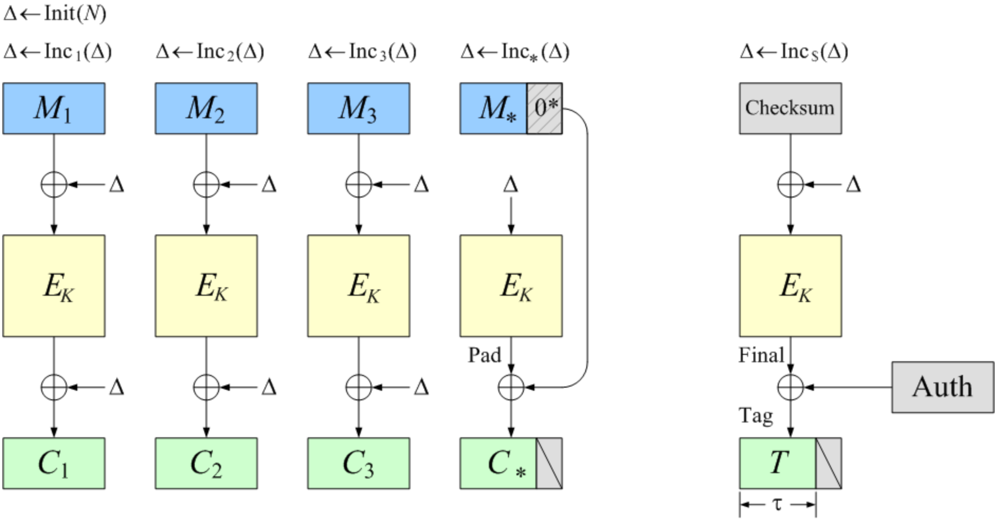
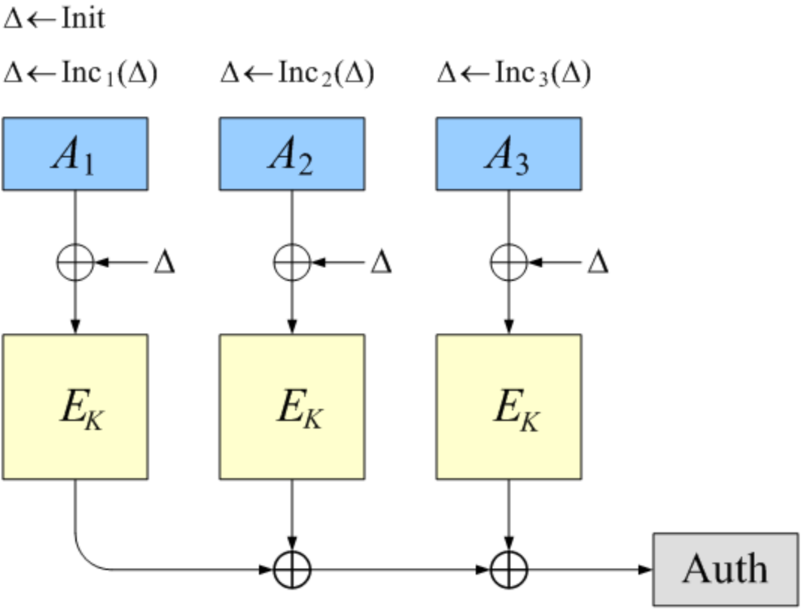

class: animation-fade
layout: true

---

class: impact

# Крипотная
## криптография

---

# Гарантии

--

## Конфиденциальность

- Невозможно извлечь перехваченную информацию, но можно подделать.

- Схема шифрования (cipher): $ c \leftarrow E(k, m) $, $ m \leftarrow D(k, c) $.

--

## Целостность

- Невозможно подделать информацию, но можно перехватить и прочитать.

- Схема аутентифицированной подписи (MAC): $ t \leftarrow S(k, m) $, $ \\{0,1\\} \leftarrow V(k, m, t) $.

--

### Что если нам нужно и то и другое?

---

# Аутентифицированное шифрование

> **A**uthenticated **E**ncryption

--

## Схема шифрования

$ c \leftarrow E(k, m) $, $ c \in C $

$ m \leftarrow D(k, m) $, 
--
$ m \in M \cup \\{ \bot \\} $

$ \bot $ или $ reject $ – _шифрованное сообщение не является валидным_.

--

Как сконструировать? 
--
Попробуем скомбинировать надёжную схему шифрования и надёжный алгоритм аутентифицированной подписи.

---

# Аутентифицированное шифрование

## SSL 3.0

.col-6[

$ E_{SSL3}((k_e, k_m), m, E, S) := $

$ \\qquad t \leftarrow S(k_m,m) $

$ \\qquad pad \leftarrow \\{0..255\\}^{l\_{pad}-1} \\| l_{pad}-1 $

$ \\qquad c \leftarrow E(k_e,m \\| t \\| pad) $

$ D_{SSL3}((k_e, k_m), c, E, V) := $

$ \\qquad m^{\\prime} \leftarrow D(k_e,c) $

$ \\qquad (m,t) \leftarrow m^{\\prime}[0..{l-l\_{pad}}], l_{pad} \leftarrow m^{\\prime}[l-1] $

$ \\qquad m \\> if \\> valid = V(k_m,m,t) \\> else \\> \bot $

]

--

.col-6[

### Насколько надёжна данная схема? 

]

--
.col-6[

Всё очень плохо. 😰

]

---

# Аутентифицированное шифрование

## Надёжность

--

* Защищаемся от _активного_ злоумышленника

    - может _перехватывать_ сообщения, как и раньше (_eavesdropping_)
    - может _модифицировать_ сообщения (_tampering_)

--

* Злоумышленник может провести CCA (**C**hosen **C**iphertext **A**ttack)

--

    Сыграем с ним в одну игру

    

---

# Аутентифицированное шифрование

## Chosen Ciphertext Attack

--

* Судья выбирает секретный ключ $ k \xleftarrow{R} K $ и делает выбор $ b \xleftarrow{R} \\{0,1\\} $

* Злоумышленник формирует множество пар сообщений $ (m\_{10},m\_{11}) .. (m\_{p0},m\_{p1}) $ и отправляет судье

* Судья возвращает шифротекст $ c\_i = E(k,m\_{ib}) $ для каждого $ i \in \\{1..p\\} $ злоумышленнику

* Злоумышленник формирует множество $ \hat{c}\_j \notin \\{ c_1 .. c_p \\} $ и предоставляет судье

* Судья возвращает $ \hat{m}\_j = D(k,\hat{c}\_j) $ для каждого $ j \in \\{1..q\\} $ и предоставляет судье

* Злоумышленник делает догадку $ \hat{b} \in {0,1} $

Вероятность того, что $ \hat{b} = b $ должна быть _крайне мала_! 

---

# Аутентифицированное шифрование

## Надёжность

Схема шифрования надёжна в условиях CCA, если:

* **она надёжна в условиях CPA** и

* **она устойчива к подделке шифротекста** (_Ciphertext Integrity_)

--

### Только тогда она достойна называтся _аутентифицированной схемой шифрования_.

---

# Аутентифицированное шифрование

## Конструкции

--

Что если мы возьмём _CPA secure cipher_ + _unforgeable MAC_? 
--
💖

--

Не все комбинации одинаково полезны. 🤢

--

* Encrypt-then-MAC

* MAC-then-Encrypt

* MAC-and-Encrypt

---

# Аутентифицированное шифрование

## Encrypt-then-MAC

$ E_{etm}((k_e, k_m), m, E, S) := $

$ \\qquad c \leftarrow E(k_e,m) $

$ \\qquad t \leftarrow S(k_m,c) $

$ \\qquad (c,t) $

--

### Всем хороша!

* Главное – не использовать один и тот же ключ для $ S $ и $ E $

--

* ...и аутентифицировать **все** данные, в том числе IV 
--
(пример: iOS пятилетней давности).

---

# Аутентифицированное шифрование

## MAC-then-Encrypt

$ E_{mte}((k_e, k_m), m, E, S) := $

$ \\qquad t \leftarrow S(k_m,m) $

$ \\qquad c \leftarrow E(k_e,(m,t)) $

--

### Не будьте как SSL 3.0 
--
и TLS 1.0

--

* Множество _padding oracle attack_

* Пара _timing attack_

--

* Тем не менее **можно построить надёжную схему шифрования**, но много тонкостей

---

# Аутентифицированное шифрование

## Encrypt-and-MAC

$ E_{eam}((k_e, k_m), m, E, S) := $

$ \\qquad c \leftarrow E(k_e,m) $

$ \\qquad t \leftarrow S(k_m,m) $

$ \\qquad (c,t) $

--

### Тоже неплохо!

--

* **Можно построить надёжную схему шифрования**, 

--

* ...но надо быть осторожным с выбором $ E $

---

# Аутентифицированное шифрование

## Комбинации

Пара важных моментов

--

* $ k_e \neq k_m $, иначе надёжность под угрозой

--

* Алгоритм расшифровки $ D $ должен быть **атомарным**, 
--
иначе будет как в SSHv2 🤕

> Our attacks against OpenSSH, where we can verifiably recover 14 bits of plaintext from an arbitrary block of ciphertext with probability $ 2^{−14} $ and 32 bits of plaintext from an arbitrary block of ciphertext with probability $ 2^{−18} $.
> <cite>Plaintext Recovery Attacks Against SSH, Martin R. Albrecht et al.</cite>

---

# Аутентифицированное шифрование

## AEAD

Схема аутентифицированного шифрования с открытыми данными (**A**uthenticated **E**ncryption with **A**ssociated **D**ata)

--

* Придуманы специально для людей, не занимающихся криптографией например, меня

--

* Все данные аутентифицированы, но не все – зашифрованы

    $ (c,d) \leftarrow E(k,m,d,nonce) $

    $ m \leftarrow D(k,m,d,nonce) $

    

---

# Аутентифицированное шифрование

## AEAD

* Если $ |m| = 0 $, с лёгкостью превращается в _MAC_.

* Если $ |d| = 0 $, с лёгкостью превращается в _AE cipher_.

--

## Стандарты

Параметризируются _CPA secure cipher_ $ E $, например AES.

--

* **GCM** (Galois Counter Mode) = CTR + Carter Wegman MAC

--

* **EAX** (Encrypt-Authenticate-Translate) = CTR + One-key MAC

---

# Аутентифицированное шифрование

## OCB (Offset Codebook Mode)

--

--

* Только один вызов $ E $ на один блок исходного сообщения

* Крайне быстро!

---

class: impact

# Осталось
## совсем немного
