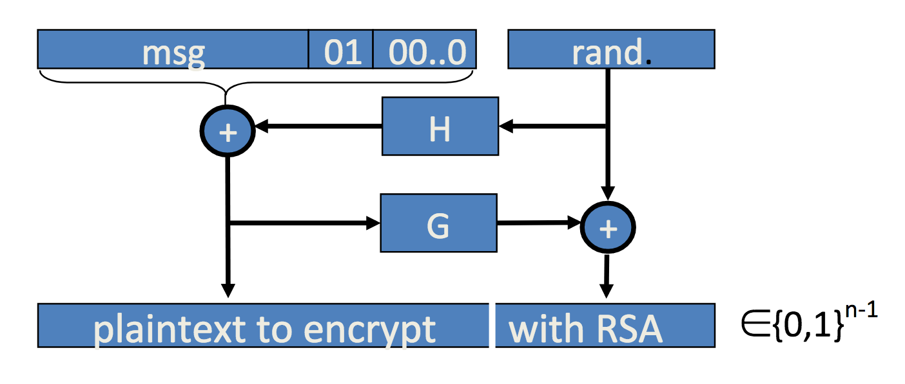

class: animation-fade
layout: true

---

class: impact

# Крипотная
## криптография

---

# Асимметрия

## Зачем?

Предположим, что я хочу собрать у вас ответы к предыдущему практическому заданию, но только так, чтобы:

--
* я мог их прочитать,

--
* никто кроме меня не смог бы, даже если бы перехватил сообщения.

---

# Асимметрия

## В чём суть?

Для этого вместо общего секретного ключа (shared secret) нам бы пригодилась пара ключей:

* публичный ключ $ pk $, чтобы им _шифровать_ сообщения
--
, но не расшифровывать!

--

* секретный (приватный) ключ $ sk $, чтобы _расшифровывать_ им зашифрованные при помощи $ pk $ сообщения.

---

# Асимметрия

## Схема шифрования

$ (G,E,D) $

* $ G $ – алгоритм генерации ключей

    $ (pk, sk) \xleftarrow{R} G() $

    * Рандомизированный!
    * Достаточно выполнить один раз для обмена ключами.

    Я генерирую пару ключей $ (pk,sk) $, $ sk $ оставляю себе, а $ pk $ публикую на общее обозрение.

---

# Асимметрия

## Схема шифрования

$ (G,E,D) $

* $ E $ – алгоритм шифрования с публичным ключом

    $ c \in C \xleftarrow{R} E(pk,m) $

    * Рандомизированный! $ c_1 \leftarrow E(pk,m), c_2 \leftarrow E(pk,m), c_1 \neq c_2 $

* $ D $ – алгоритм расшифровки с секретным ключом

    $ m \in M \cup \\{ \bot \\} \leftarrow D(sk,c) $

    * Детерминированный! Иначе нет смысла. 🙄

---

# Асимметрия

## Как построить?

--

Ответ есть – trapdoor one-way functions. 
--
🤔

--

$ (G,F,F^{-1}) $

$ (pk, sk) \xleftarrow{R} G() $

$ y \leftarrow F(pk,x) $

$ x \leftarrow F^{-1}(sk,x) $

--

* $ F^{-1} $ – _эффективно вычислимая_ функция, только если $ sk $ известен.

--

* $ sk $ – тот самый _trapdoor_.

--

* _Надёжная_ TDF – вероятность определить $ x $ по $ y $ без $ sk $ _крайне мала_.

---

# Асимметрия

## RSA

--

$ G_{RSA}(l,e) := $

1. Сгенерировать случайное простое число $ p $ длиной $ l $ бит, так чтобы $ gcd(e,p-1) = 1 $.

2. Сгенерировать случайное простое число $ q $ длиной $ l $ бит, так чтобы $ gcd(e,q-1) = 1 $ и $ q \neq p $.

3. $ n \leftarrow pq $

4. $ d \leftarrow e^{-1} \pmod{(p-1)(q-1)} = e^{-1} \pmod{\varphi(n)} $

5. Получаем $ sk = (n,d) $ и $ pk = (n,e) $

--

$ F_{RSA}((n,e),x) := x^e \pmod{n} $

--

$ F^{-1}_{RSA}((n,d),y) := y^d \pmod{n} $ 

---

# Асимметрия

## RSA

Как так?

--

$ F^{-1}_{RSA}((n,d),y) $

$ = y^d \pmod{n} $

--

$ = x^{ed} \pmod{n} $ 

--

$ = x^{k\varphi(n)+1} \pmod{n} $ 

--

$ = {(x^{\varphi(n)})}^k \cdot x \pmod{n} $ 

--

$ = x \pmod{n} $

---

# Асимметрия

## Надёжность RSA

--

* Насколько сложно вычислить $ c^{1/e} \pmod{n} $?

--

* Утверждают что настолько же сложно, насколько определить $ p $ и $ q $ такие, что $ n = p \cdot q $.

    Задача _факторизации_.

    Сложность лучшего известного алгоритма (NFS): $ \exp(\tilde{O}(\sqrt\[3\]{l})) $ для простого числа длиной $ l $ бит.

    Сложность напрямую несопоставима:

| Длина ключа AES |   | Длина $ n $ RSA |
| --------------- | - | --------------- |
| 80              | ~ | 1024            |
| 128             | ~ | 3072            |
| 256             | ~ | 15360           |

---

# Асимметрия

## Конструкции

* Берём надёжную TDF $ F $, надёжную хэш-функцию $ H $ и надёжную к CCA схему шифрования $ (E_s,D_s) $.

--

* Получаем _надёжную к CCA_ схему $ (E, D) $, где

.col-6[

$ E(pk,m) := $

$ \\quad x \xleftarrow{R} X, y \leftarrow F(pk,x), k \leftarrow H(x) $

$ \\quad c \leftarrow E_s(k,m) $

$ \\quad (y, c) $

]

.col-6[

$ D(sk,(y,c)) := $

$ \\quad x \leftarrow F^{-1}(sk,y), k \leftarrow H(x) $

$ \\quad m \leftarrow D_s(k,c) $

$ \\quad m $

]

---

# Асимметрия

## Конструкции

### PKCS1 v2

* В качестве $ H, G $ можно использовать SHA256.

---

# Асимметрия

## Зачем ещё?

Предположим, что я хочу установить канал для защищённого общения с кем-то из вас.

Чтобы это сделать, мне нужно иметь общий секретный ключ (_shared secret_), но у меня нет его.

--

Я должен суметь обменяться сообщениями так, чтобы:

* у нас в результате появился общий секретный ключ,
* и никто из подслушивающих наше общение не смог бы узнать этот секретный ключ.

--

Звучит фантастически, но это возможно. ✨

--

Задача для _схемы обмена ключами_ (_key exchange_ или просто _kex_).

---

# Асимметрия

## Diffie-Hellman

Или просто DH.

Предположим, что $ p $ – большое 2048-битное простое число, а $ q $ – большое 256-битное число, для простоты дискуссии тоже простое, а кроме того такое, что $ (p - 1) \mod q = 0 $.

Это всё значит, что можно выбрать $ g \in \mathbb{Z}_{p}^{*} $ такой, что $ ord(g) = q $.

--

Все значения $ p, q, g $ известны заранее, публичны, открыты, и этот факт не влияет на надёжность схемы.

---

# Асимметрия

## Diffie-Hellman

1. Я выбираю случайное <big>большое</big> $ \alpha \in \mathbb{Z}\_{q} $, вычисляю $ u \leftarrow g^{\alpha} \pmod{p} $, которое и отправляю _партнёру по общению_.

2. _Партнёр_ выбирает случайное <big>большое</big> $ \beta \in \mathbb{Z}\_{q} $, вычисляет $ v \leftarrow g^{\beta} \pmod{p} $ и отправляет его мне.

3. Получив $ v $, я вычисляю $ w \leftarrow v^{\alpha} \pmod{p} = g^{\beta\alpha} \pmod{p} $.

4. Получив $ u $, _партнёр_ вычисляет $ w \leftarrow u^{\beta} \pmod{p} = g^{\alpha\beta} \pmod{p} $.

У нас с _партнёром_ на руках одно и то же значение $ w = g^{\alpha\beta} \pmod{p} $!

---

# Асимметрия

## Надёжность

У подслушивающих нас лиц на руках остались только $ u = g^{\alpha} \pmod{p} $ и $ v = g^{\beta} \pmod{p} $.

* Могут ли они вычислить $ g^{\alpha} \pmod{p} $?

--

* Считается, что это столь же сложно, сколь сложна задача _факторизации_ сходной размерности.

    - Сложность лучшего известного алгоритма равна $ \exp(\tilde{O}(\sqrt\[3\]{l})) $ для простого числа $ p $ длиной $ l $ бит.

--

* К сожалению, схема не гарантирует _аутентичности_
--
, значит злоумышленник может встать посередине (_man in the middle_), перехватывать и можифицировать сообщения.

---

# Асимметрия

## Конструкции

Можно ли построить схему шифрования с публичным ключом? 
--
Можно.

### ElGamal

$ G(p,q) := $

$ \\quad g \xleftarrow{R} G, \alpha \xleftarrow{R} \mathbb{Z}\_{q}, h \leftarrow g^{\alpha} \pmod{p} $

$ \\quad sk = \alpha $, $ pk = (g,h) $

---

# Асимметрия

### ElGamal

$ E((g,h),m) := $

$ \\quad \beta \xleftarrow{R} \mathbb{Z}\_{q}, u \leftarrow g^{\beta} \pmod{p}, v \leftarrow h^{\beta} \pmod{p} $

$ \\quad k \leftarrow H(u,v) $

$ \\quad c \leftarrow E_s(k,m) $

$ \\quad (u,c) $

$ D(\alpha,(u,c)) := $

$ \\quad v \leftarrow u^{\alpha} \pmod{p} $

$ \\quad k \leftarrow H(u,v) $

$ \\quad m \leftarrow D_s(k,c) $

---

class: impact

# Всё
